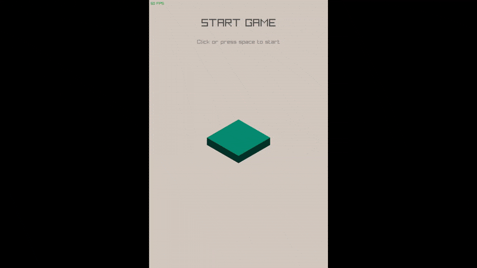

# Learn Graphics Using Raylib

A personal exploration of computer graphics, 3D math, and simulation principles — built from scratch in C++ using raylib.

##  Project Overview

This project was created as a learning environment to deepen my understanding of 3D graphics programming, simulation systems, and the mathematical principles behind them.
It began as a small experiment to build a minimal graphics sandbox where I could gradually implement core systems like:

* Camera control

* Physics timing

* Input abstraction

* Spatial partitioning

* Basic game loop design

and later explore geometry, animation, and simulation through small experiments.

## Structure & Components

The codebase is modular and designed for experimentation.
Below are the main systems I implemented:

### 1. Core Engine Layer

main.cpp – Initializes the engine loop (Init, Update, Shutdown) and handles draw/update separation.
Provides a clear entry point similar to a minimal game engine architecture

cameraSystem.hpp – Custom 3D camera controller using raylib’s low-level API.
Supports both orthographic and perspective projections

timeSystem.hpp – Simple timing manager that tracks deltaTime per frame for consistent motion and animation

inputSystem.hpp – Encapsulated keyboard input system using raylib’s input handling

### 2. Math & Spatial Utilities

Custom lightweight math library with Vec2 and Vec3 classes (operator overloading, safe normalization, dot/cross, lerp, clamp, etc.).

It serves as a personal reimplementation of vector math to understand low-level geometry handling.

QuadTree.hpp – A fully functional generic quadtree template for broad-phase collision and spatial queries, including debug visualization.

### 3. Simulations & Experiments

flockSim.hpp (in progress) – Planned implementation of a boid-based flocking simulation using the quadtree for efficient neighborhood detection.

FallingCubes.hpp – A tower stacking mini-game prototype demonstrating motion, collision logic, and visual transitions.

* Procedural color generation

* Block placement & fall physics

* Overlay UI animation (fade in/out, score)

* 3D transformations and shader usage

*  FallingCubes

### 4. Rendering Setup

Orthographic 3D camera for stable scale-independent visuals.

Configurable wireframe vs. shaded render modes.

Integration with custom GLSL lighting shader (lighting_vertex.glsl, lighting_fragment.glsl).

## Technical Highlights
Category	Description
#### Language & Libraries:
	C++17, Raylib, rlgl, custom math utilities
#### Main Focus:
Low-level graphics programming, simulation logic, math for geometry.
#### Math Topics:
Linear algebra (vectors, dot/cross, projections), coordinate transformations, interpolation.
#### Engine Concepts:
Game loop, ECS-like structure, time-step integration, input abstraction
#### Design Style:
Modular, experimental, built to learn rather than ship,
Mathematical & Algorithmic Focus.

----

#### This project served as a bridge between mathematical theory and practical graphics programming:

- Reimplemented vector algebra to understand geometric operations at code level.

- Experimented with spatial data structures (QuadTree) for O(log n) spatial queries.

- Integrated temporal logic (dt) for stable physics updates.

- Worked on understanding projection math via custom camera implementations.

- Investigated procedural color generation via trigonometric patterns.

## Status

#### This project was paused mid-development after implementing the core systems.

## Lessons Learned

- How 3D coordinate systems and cameras interact — practical understanding of world vs. view transformations.

- How to structure a minimal game engine loop with modular subsystems.

- How to build reusable mathematical primitives from scratch.

- Balancing clarity and flexibility when architecting simulation systems.

- Implementing geometric algorithms like broad-phase collision detection and vector projection.

- Add some more mini-games for fun and integrate art from external tools like krita and blender.

## Author’s Note

This project was never meant to be a finished game —
it’s a study sandbox, a way to translate theoretical math and algorithmic thinking into something visual and tangible.

I built it to understand why things move the way they do — not just how to code them.

## How to Run

- Install raylib

- Compile with any modern C++17 compiler

` g++ main.cpp -std=c++17 -O2 -lraylib -o LearnGraphics
./LearnGraphics`

- Use mouse and keyboard to explore:

SPACE / Mouse click – interact (place cubes)

W – wireframe mode

S – shaded mode

## Future Improvements

- Implement full flockSim behavior (boids)

- Add physics-based motion integration

- Enhance shader lighting & reflections

- Modularize into a reusable “mini-engine”

## Gallery 
#### tower stocking demo | shaders, game design

---
#### Flock simulation using quadtree | data structures, preformance
